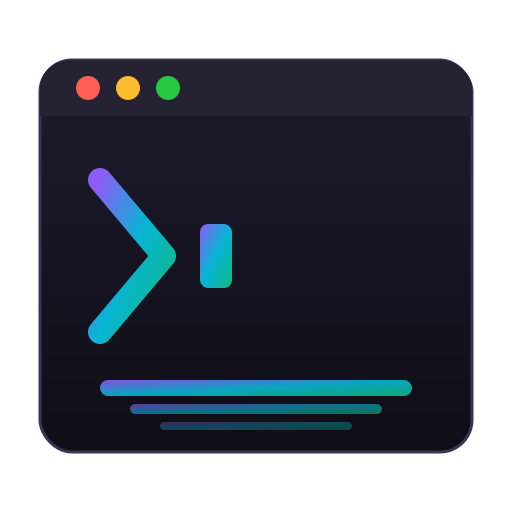

# ShellShade

<p align="center">
  
</p>

<p align="center">
  <strong>Cross-platform terminal theme manager with CLI and GUI</strong><br>
  Browse, preview, and apply beautiful color schemes to your terminal in seconds.
</p>

<p align="center">
  <a href="#features">Features</a> •
  <a href="#installation">Installation</a> •
  <a href="#usage">Usage</a> •
  <a href="#supported-terminals">Supported Terminals</a> •
  <a href="#built-in-themes">Themes</a> •
  <a href="#contributing">Contributing</a>
</p>

---

## Features

- **43+ Built-in Themes** — Dracula, Nord, Tokyo Night, Catppuccin, Gruvbox, One Dark, Rosé Pine, and many more
- **Cross-Platform** — Native support for macOS, Windows, and Linux
- **Multi-Terminal Support** — One tool for all your terminals
- **Auto-Detection** — Automatically detects which terminal you're running
- **Live Preview** — See themes with full 16-color ANSI palette before applying
- **Favorites** — Star your favorite themes for quick access
- **Instant Apply** — Themes apply immediately, no restart required (most terminals)
- **CLI + GUI** — Interactive TUI for the terminal, or a full Electron desktop app

## Supported Terminals

| Platform | Terminals |
|----------|-----------|
| **macOS** | Terminal.app, iTerm2, Warp, Alacritty, Kitty |
| **Windows** | Windows Terminal, PowerShell, Alacritty, Kitty |
| **Linux** | GNOME Terminal, Konsole, Alacritty, Kitty |

## Installation

### CLI (Recommended)

```bash
# Install globally via npm
npm install -g shellshade

# Or use npx without installing
npx shellshade
```

### From Source

```bash
# Clone the repository
git clone https://github.com/masecode67/shellshade.git
cd shellshade

# Install dependencies
npm install

# Build the project
npm run build

# Link the CLI globally
npm link

# Or run the desktop app
npm run dev
```

### Desktop App

Download the latest release from the [Releases](https://github.com/masecode67/shellshade/releases) page.

## Usage

### Interactive TUI

Simply run `shellshade` with no arguments to launch the interactive terminal UI:

```bash
shellshade
```

This opens a menu where you can:
- Browse all themes with color previews
- Search themes by name or author
- Apply themes with one keypress
- Manage your favorites
- Switch between terminals

### CLI Commands

```bash
# Launch interactive TUI
shellshade

# List all available themes
shellshade list

# Apply a theme (auto-detects your terminal)
shellshade apply dracula

# Apply a theme to a specific terminal
shellshade apply "Tokyo Night" -t iterm2
shellshade apply nord -t windows-terminal
shellshade apply gruvbox -t kitty

# Show help and supported terminals
shellshade help
```

### Desktop App

The desktop app provides a visual interface for:
- Browsing themes with large previews
- Creating and editing custom themes
- Importing themes from files
- One-click installation to any terminal

## Built-in Themes

ShellShade comes with 43 carefully curated themes:

**Dark Themes**
- Catppuccin Mocha, Dracula, Nord, Tokyo Night, One Dark
- Gruvbox Dark, Rosé Pine, Kanagawa, Moonlit, Nocturnal
- Deep Ocean, Ember Glow, Midnight Ember, Nebula, Neon Dreams
- Pacific, Slack Ochin, Twilight, Winter is Coming

**Light Themes**
- Catppuccin Latte, One Light, Nord Light, Tokyo Night Light
- Gruvbox Light, Rosé Pine Dawn, Atom One Light, Ayu Light
- Clean Slate, Clear Sky, Horizon Light, Light Owl, Min Light
- PaperColor Light, Quiet Light, Sand Dune, Soft Morning
- Solarized Light, Winter is Coming Light

## How It Works

ShellShade applies themes differently depending on your terminal:

| Terminal | Method |
|----------|--------|
| **Terminal.app** | AppleScript to create/update profiles |
| **iTerm2** | Dynamic Profiles (JSON files) + AppleScript |
| **Warp** | YAML theme files in `~/.warp/themes/` |
| **Windows Terminal** | Edits `settings.json` color schemes |
| **PowerShell** | Updates PSReadLine colors in profile |
| **GNOME Terminal** | dconf/gsettings profile creation |
| **Konsole** | `.colorscheme` files |
| **Alacritty** | TOML theme files |
| **Kitty** | `.conf` theme files |

## Project Structure

```
shellshade/
├── src/
│   ├── cli/           # CLI/TUI application
│   ├── main/          # Electron main process
│   ├── renderer/      # Electron React frontend
│   ├── preload/       # Electron preload scripts
│   └── shared/        # Shared types and utilities
├── resources/
│   ├── builtin-themes/  # 43 built-in theme files
│   └── icons/           # App icons
└── dist/              # Built output
```

## Configuration

ShellShade stores its data in platform-specific locations:

| Platform | Location |
|----------|----------|
| **macOS** | `~/Library/Application Support/shellshade/` |
| **Windows** | `%APPDATA%/shellshade/` |
| **Linux** | `~/.config/shellshade/` |

## Development

```bash
# Install dependencies
npm install

# Run in development mode (Electron app)
npm run dev

# Build everything
npm run build

# Build only CLI
npm run build:cli

# Run CLI directly
npm run cli

# Package desktop app
npm run package
```

## Tech Stack

- **CLI**: Node.js, TypeScript, Enquirer, Chalk
- **Desktop**: Electron, React, TypeScript, Tailwind CSS
- **Database**: SQLite (better-sqlite3)
- **Build**: Vite, electron-builder

## Contributing

Contributions are welcome! Please see [CONTRIBUTING.md](CONTRIBUTING.md) for guidelines.

### Adding New Themes

1. Create a JSON file in `resources/builtin-themes/`
2. Follow the existing theme format
3. Submit a pull request

### Theme Format

```json
{
  "name": "My Theme",
  "author": "Your Name",
  "colors": {
    "background": "#1a1b26",
    "foreground": "#c0caf5",
    "cursor": "#c0caf5",
    "cursorText": "#1a1b26",
    "selection": "#33467c",
    "selectionText": "#c0caf5",
    "ansi": {
      "black": "#15161e",
      "red": "#f7768e",
      "green": "#9ece6a",
      "yellow": "#e0af68",
      "blue": "#7aa2f7",
      "magenta": "#bb9af7",
      "cyan": "#7dcfff",
      "white": "#a9b1d6",
      "brightBlack": "#414868",
      "brightRed": "#f7768e",
      "brightGreen": "#9ece6a",
      "brightYellow": "#e0af68",
      "brightBlue": "#7aa2f7",
      "brightMagenta": "#bb9af7",
      "brightCyan": "#7dcfff",
      "brightWhite": "#c0caf5"
    }
  }
}
```

## License

MIT License - see [LICENSE](LICENSE) for details.

## Acknowledgments

- Theme colors sourced from their respective creators
- Inspired by [gogh](https://github.com/Gogh-Co/Gogh), [base16](https://github.com/chriskempson/base16), and [terminal.sexy](https://terminal.sexy)

---

<p align="center">
  Made with caffeine and terminal emulators
</p>
